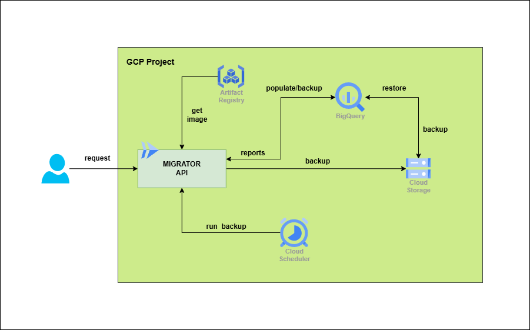

# db-glbt-migrator

## Introduction
This repository contains the solution to the code challenge related to building an API that executes some data related processes.

### Architecture


### Project structure
The repository is divided into this set of folders:

* **config/** All config files are placed into this folder (in this case, only environment variables file is placed here).
* **infra/** Terraform files are placed in this folder. These files are used to create the underlying infrastructure, such as the GCS Bucket, BigQuery Dataset, GCP project, etc.
* **migrations/** SQL files to create tables and load historic data into them.
* **scripts/** Shell scripts to run some utilitary processes, such as push to Artifactory, deploy new version into Cloud Run, et
* **src/** Source code related to the API

## Installation
In order to replicate the project, it is required to follow some steps:

* Set some required environment variables
```
export BILLING_ACCOUNT="<YOUR_GCP_BILLING_ACCOUNT>"
export PROJECT_ID="glbt-challenge-migrations"
export DATASET_ID="bq_glbt_migrator"
export TAG_NAME="<TAG_VERSION>"   # e.g. v0.0.1
export SERVICE_NAME="bq-glbt-migrator"
export DEFAULT_SA="${SERVICE_NAME}@${PROJECT_ID}.iam.gserviceaccount.com"
```
* Run Terraform commands to create resources:
```
terraform init
terraform plan -var-file vars/prod.tfvars -var billing_account=$BILLING_ACCOUNT
terraform apply -var-file vars/prod.tfvars -var billing_account=$BILLING_ACCOUNT
```
* Set environment variable with the bucket created by Terraform:
```
export BUCKET_NAME="<YOUR_BUCKET_NAME>"
```
* Run script to upload csv files to GCS (`scripts/upload_table_files.sh`).
* Run migration scripts. These scripts can be run from the BigQuery console in GCP.
* Upload first Docker image version into GCP Artifactory (`scripts/push_docker_version.sh`).
* Deploy first version from the API in Cloud Run (`scripts/deploy_cloud_run.sh`).

**NOTE:**  Project ID, service name and dataset ID variables can be changed, but they also need to be modified into Terraform variables file.

## API details

### API URL
URL: `https://bq-glbt-migrator-508891629639.us-central1.run.app`

### API endpoints
* `/<table_name>/insert`: Insert the given rows into **<table_name>**
    * **body:**
      ```
      {
          rows: [
              {"COL1": <VAL1_1>, "COL2": <VAL2_1>, ...},
              {"COL1": <VAL1_2>, "COL2": <VAL2_2>, ...},
              ...
          ]
      }
      ```
      
* `/<table_name>/backup`: Create a backup into GCS for **<table_name>**
* `/<table_name>/restore`: Restore **<table_name>** from the created in GCS
* `/metrics/report1`: Create first report required in the challenge
   * **response:**
     ```
     {
         "message": "Report generated successfully.",
         "data": [
             {"department": "d1", "job": "j1", "Q1": 0, "Q2": 1, "Q3": 2, "Q4": 0},
             {"department": "d2", "job": "j2", "Q1": 2, "Q2": 3, "Q3": 0, "Q4": 1},
             ...
         ]
     }
     ``` 
* `/metrics/report2`: Create second report required in the challenge
   * **response:**
     ```
     {
         "message": "Report generated successfully.",
         "data": [
             {"id": 1, "department": "d1", "hired": 105},
             {"id": 2, "department": "d2", "hired": 54},
             ...
         ]
     }
     ```
   
